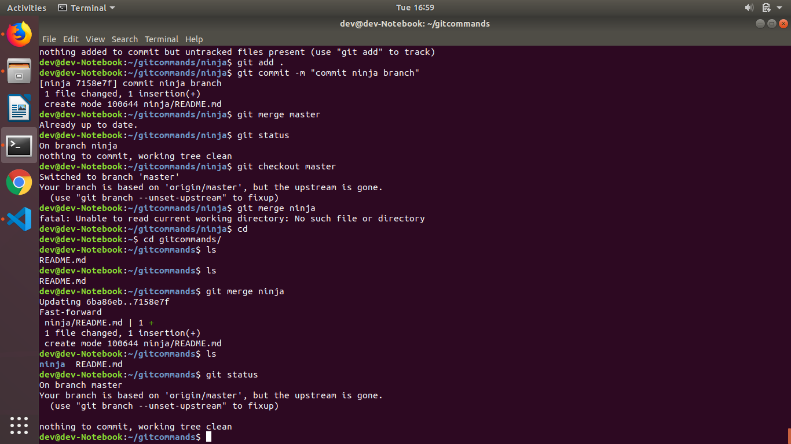
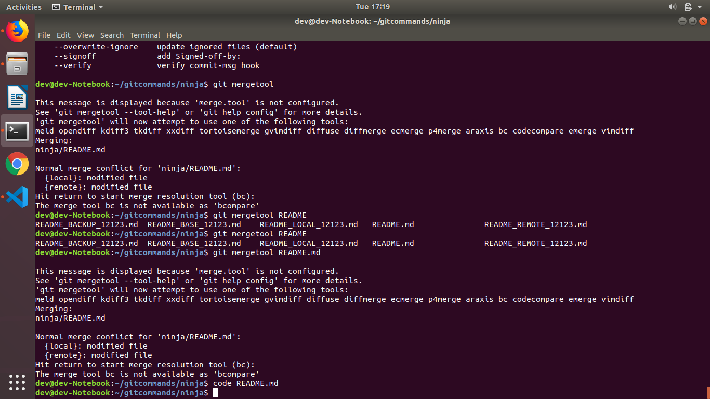
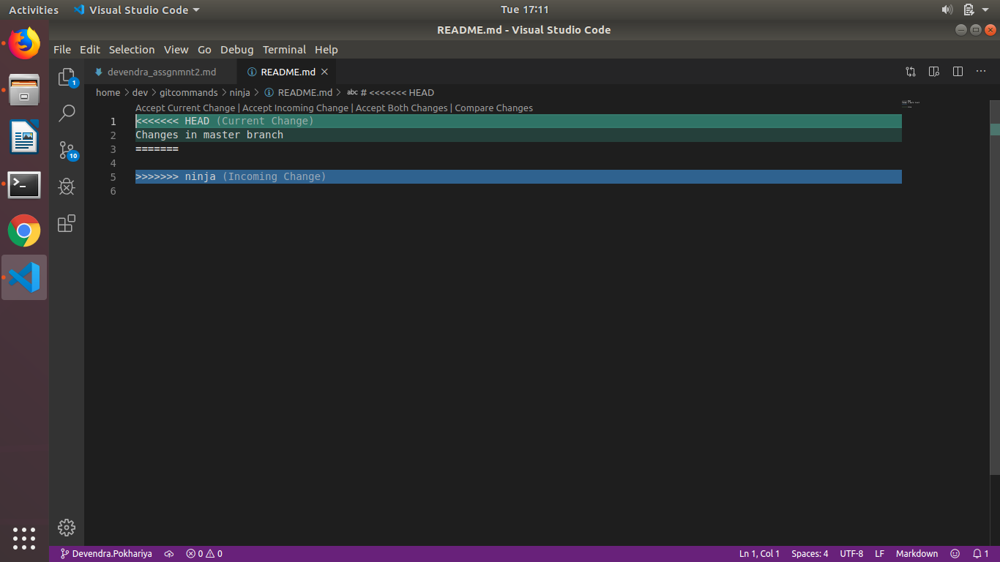
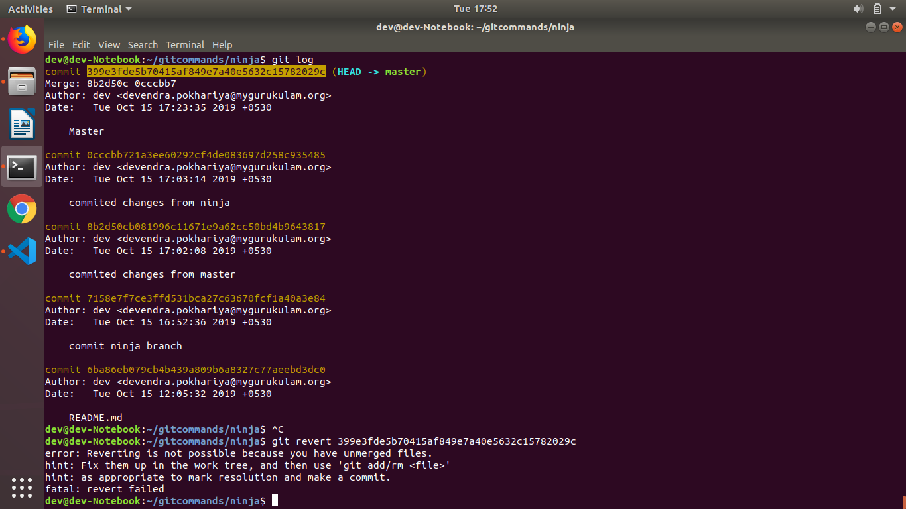
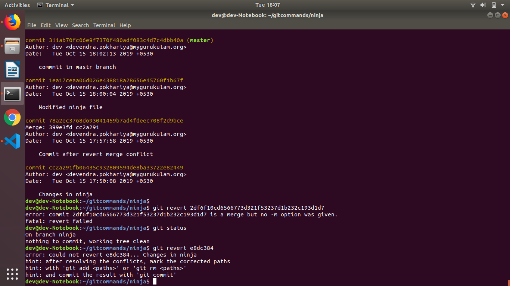
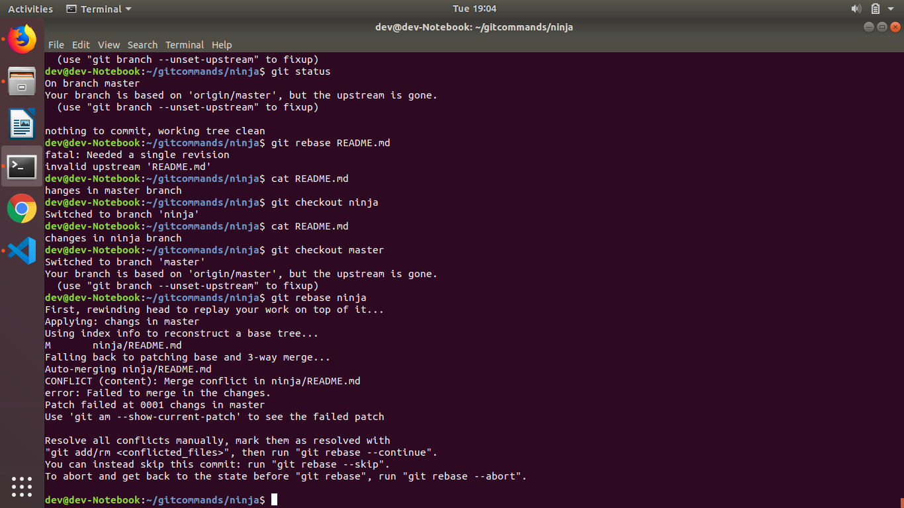
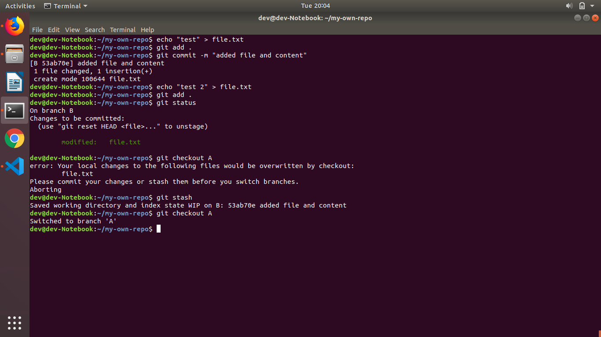

# 30K Feet View

## Introduction
In this section we will build understanding around git merge operation

## References
* https://git-scm.com/docs/git-merge
* https://git-scm.com/book/en/v2/Git-Branching-Basic-Branching-and-Merging

## Assignments
We will continue with our *GitCommand* remote repository
### Must Do
* Create a folder *ninja* at the root level of your cloned code
```
bash mkdir ninja

```
* Add a file *README.md* with content "Trying fast forward merge"
```
cd ninja
bash echo "Trying fast forward merge" | cat > README.md
```
* Create a branch *ninja* and move to it
```
git branch ninja
git checkout ninja
```

* Run *git status* command
```
git status
```
* Commit your changes to *ninja* branch
```
git add .
git commit -m "commit ninja branch"
```


* Merge *ninja* branch to *master* branch make sure that a new commit get's created
```
git checkout master
git merge ninja
```

* Assuming you are in *master* branch, modify *README.md* with content *Changes in master branch*, commit the changes in *master* branch.
```
echo > "Changes in master branch" > README.md
git add .
git commit -m "commited changes from master"
```
* Switch to *ninja* branch, modify *README.md* with content *Changes in ninja branch*, commit the changes in *ninja* branch.
```
git checkout ninja
echo > "Changes in ninja branch" > README.md
git add .
git commit -m "commited changes from ninja"
```
* Merge *master* branch to *ninja* branch in such a fashion that changes of *master* branch overrides changes in *ninja* branch
```
git checkout master
git merge ninja
Auto-merging ninja/README.md
CONFLICT (content): Merge conflict in ninja/README.md
Automatic merge failed; fix conflicts and then commit the result.

code README.md
    OR
" git reset --hard HEAD~1"
```
remove <===HEAD



* Revert the above merge commit
```
git revert 399e3fde5b70415af849e7a40e5632c15782029c
```
it gave a error
error: Reverting is not possible because you have unmerged files.
hint: Fix them up in the work tree, and then use 'git add/rm <file>'
hint: as appropriate to mark resolution and make a commit.
fatal: revert failed


* Merge *master* branch to *ninja* branch in such a fashion that changes of *ninja* branch overrides changes in *master* branch
```
git checkout ninja
git merge master
```
o/p Auto-merging ninja/README.md
CONFLICT (content): Merge conflict in ninja/README.md
Automatic merge failed; fix conflicts and then commit the result.
```
 code README.md 
 ```
 add or remove you want in the file
 ```
 git add .
 git commit
 ```
[ninja 2df6f10] Merge branch 'master' into ninja


* Revert the above merge commit
```
git revert e8dc384
error: could not revert e8dc384... Changes in ninja
hint: after resolving the conflicts, mark the corrected paths
hint: with 'git add <paths>' or 'git rm <paths>'
hint: and commit the result with 'git commit'

```


* Merge *master* branch to *ninja* branch in such a fashion that changes of both branches gets accumulated.

```
git checkout master
git merge ninja

```
conflict
Auto-merging ninja/README.md
CONFLICT (content): Merge conflict in ninja/README.md
Automatic merge failed; fix conflicts and then commit the result.

```
 code README.md
 git add .
 git commit -m"final changes" 
```
### Good To Do
* Simulate the above scenarios using rebase
```
echo > "Changes in master branch" > README.md
git add .
git commit -m "commited changes from master"

git checkout ninja

echo > "Changes in ninja branch" > README.md
git add .
git commit -m "commited changes from ninja"
```

git checkout master
 git rebase ninja

```


vim diif
Add or remove what line of code you want to change
```
![images][images/rebasediff.png)


* Create 2 repositories in you Git Lab account *Repo1* & *Repo2* in *Repo1*. Create 2 branches *branchR11 and branchR12* in *Repo1*, similarly create 2 branches *branchR21 and branchR22* in *Repo2*. Now merge code of branch *branchR11* in *Repo1* to *branchR22* in *Repo2*.

[image][images/repo12]

```
 git clone "git@gitlab.com:devendra.pokhariya/repo1.git"
 git branch branchR11
 git branch branchR12
 git checkout branch12
 touch mycode.sh
git add .
git status
```
 [image][images/repo11]

```
 git commit -m "Adding my code in branch22"

 git status

 git checkout master
 git merge branchR22 
 git status

 git clone "git@gitlab.com:devendra.pokhariya/repo2.git
 git branch branchR21
 git branch branchR22
 git checkout branch22
 touch coder22.sh
git add .
git status
 
 git commit -m "Adding my code in branch22"

 git status

 git checkout master
 git merge branchR22 
 git status

```


## Learning
In this section you learned about git branching
* Fast forward merge
* Auto Merge
* Merge with conflict
* Commit revert
* rebase

# 30K Feet View

## Introduction
In this section we will build understanding around git advanced commands
* stash
Suppose you are in a messy situaton where you haven't completed your work but you have to switch to another branch for some work at that time to save our incomplete work we use stash. git stash saves our curent incomplete change at random index in staging area.
we can check all our stash by running a command
git stash list

and you can pop out the stashed code by running 
git stash pop

* reset

it will unstage all the changes from the previous commit but it preserve the changes in file.
git reset commit undoes all the commits after the specified commit and preserve the changes locally

git reset --hard discards all history and goes back to the specifies commit

* clean

where git reset and git checkout operate on files previously added to git tracking index, the git clean command operates on untracked files.
So the files that were created within the repo but have not been added in working repo. 


## References
* https://www.atlassian.com/git/tutorials/resetting-checking-out-and-reverting

## Assignments
### Must Do
 
* Suppose you have two branches say branch A and branch B. Currently you are working in Branch B.
```
git branch A
git branch B

git checkout B

```
* Create any file with any content in branch B and add it in staging area but dont commit it.
```
echo "test" > file.txt
git add file.txt
git commit -m "changes done"

echo "ssecond test" >file.txt
git add file.txt
```

* Try to switch to Branch A. If its failing, then find a way out to switch to Branch A without commiting file in branch B.

```
git checkout A

error: Your local changes to the following files would be overwritten by checkout:
	file.txt
Please commit your changes or stash them before you switch branches.

git stash
git checkout A

```


* Read about git reset (Soft, Mixed and Hard) command and implement it in your local git repository. And write your observations in each method 
* (Soft, Mixed and Hard) Note: Dont copy paste from the internet. Write it in very simple language.

git reset can be used while undoing some changes there are different scenario where you use these reset commands mainly there are three types of reset 
i.e. soft mixed hard

```
--soft: uncommit changes, changes are left staged (index).

--mixed (default): uncommit + unstage changes, changes are left in working tree

--hard: uncommit + unstage + delete changes, nothing left.

```

* Create a shell script which will take a number "n" as a input from user and script will revert the changes upto "n" no of commits. 
* And if "n" is greater than no of commits in the branch in your git repository, then it should print "Invalid input 
* (Input provided is greater than no of commits in the branch)" 
```
#!/bin/bash
function inputUser(){
if [ -z $1 ]
then
    NUM="ok"
else
    NUM=$1
fi
}
function checkLogCount(){
inputUser
echo $NUM
LOGCOUNT=$(git log --oneline | wc -l)
if [ $NUM>$LOGCOUNT ]
then
    echo $LOGCOUNT
    REVERTIN="NA"
    
else
    if [ $NUM!="ok" ]
    then
        REVERTIN=$(git log --oneline | nl | awk '{print $2}' | head -$NUM )
    else
        REVERTIN=$(git log --oneline | nl | awk '{print $2}')
    fi
fi
}

function main() {
    checkLogCount
if [ $REVERTIN=="NA" ]
then
        echo "Invalid input (Input provided is greater than no of commits in the branch)"
else
    for i in $REVERTIN;
    do
        git revert $i 
    done;
fi
}
main

```

* Create a shell script which will take below inputs from user
  1. Remove untracked file (yes/No)
  2. Remove untracked directories (yes/No)
  and script will remove files or directories from git repo acc to the inputs given by the user.
[shellscriptclean.sh]

```
#!/bin/bash
read -p "Remove untracked file (yes/No): " INPUT
if [ "$INPUT"=="yes" ]
  then
   echo "Removing untracked file ..."
    git clean -fx
 elif [ $INPUT=="no" ]
    then
    echo "OK . No deletion of file"
 else
    echo "Nothing to do !"
exit 1
fi
read -p "Remove untracked directories (yes/No): " DIRINPUT
if [ $DIRINPUT=="yes" ]
  then
   echo "Removing untracked file ..."
    git clean -fd
 elif [ $DIRINPUT=="no" ]
    then
    echo "OK . No deletion of file"
 else
    echo "Nothing to do !"
exit
fi
```

### Good To Do

* Change git log format to below format:
  <commit hash(red colour)> - <commit message(blue color)> - <commiter_date> 


* Read about Git Hooks.
  Using Git hooks vaildate the commit message. Eg: If any developer commits anything , 
then commit message should start from "Opstree--" string, 
otherwise it should print "Invalid commit message. Please start you ur commit msg with Opstree--" 
```
cd gitcommand/.git/hooks
vim commit-msg.sample
Add the following line
#!/bin/sh
test "" = "$(grep '^Opstree--*' "$1")" && {
echo >&2 "Start the commit message with a Opstree-- followed by the msg"
exit 1
}
exit 0
rename the file commit-msg
chmod +x commit-msg
```
* Read about other advanced git commands.


## Learning

* stash
* reset
* clean
* revert
* Git Hooks
* Pretty Logs

